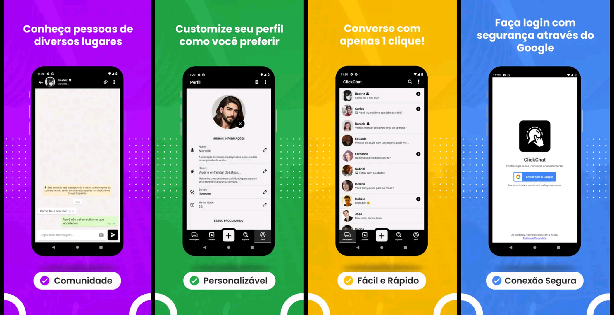

# 📱 ClickChat - Modern Android Messaging Application



## Layers: [ client | [server](https://github.com/gitmachado/click-chat-server) | [admin](https://github.com/gitmachado/admin-app--click-chat) ]


> 🧪 Project under development.

ClickChat is a real-time Android messaging application built with React Native. It features a modern interface, robust capabilities, and cross-platform support.

---

# 📚 Table of Contents

- [📱 Prerequisites](#-prerequisites)
- [🚀 Getting Started](#-getting-started)
- [✨ Features](#-features)
- [🛠 Tech Stack](#-tech-stack)

---

## 📱 Prerequisites

Before getting started, ensure you have the following tools and configurations:

- **React Native CLI**  
- **[Node.js](https://nodejs.org/)** (v18 or higher) – Required to run Metro Bundler and ClickChat-Server  
- **[npm](https://www.npmjs.com/)** or **[yarn](https://yarnpkg.com/)** – To install project dependencies  
- **Android SDK && JDK 17 (to run Gradle)** – Properly set in system environment variables (`ANDROID_HOME` and `JAVA_HOME`)  
- **Android emulator** (e.g. Genymotion) **or** a real device with USB connection
  - On real devices, install USB driver for your mobile device on PC and enable the following option on mobile device:  
    - **Developer Options** → **USB debugging (enabled)**

---

# 🚀 Getting Started

Clone the repository, install dependencies and run:

```bash
# Clone the repository
git clone https://github.com/gitmachado/click-chat-client.git

# Navigate to the project folder
cd click-chat-client

# Install dependencies
npm install
# or
yarn install

# Start the Metro Bundler
npx react-native start
```

# ✨ Features

- ✅ Real-time messaging with WebSocket  
- ✅ Cloud login with Google  
- ✅ Effective user blocking functionality
- ✅ Light and Dark theme support  
- ✅ Cloud push notifications with Firebase 
- ✅ Fast image and voice message sharing 
- ✅ Emoji picker  
- ✅ Full profile customization  
- ✅ Favorite contacts feature  
- and more...

---

# 🛠 Tech Stack

### 🧩 Core
- **React Native v0.73.4**  
  Main framework for easy cross-platform mobile development

---

### 🗂️ State Management & Pesistent Storage
- **Redux**  
  Global state management with pure functions  
- **Context API (React Built-in)**  
  Global state and side-effect handling (e.g., cloud login)  
- **@react-native-async-storage/async-storage v1.22.2**  
  Persistent local data storage for user configurations and caching

---

### 🔐 Authentication & Cloud Services
- **@react-native-firebase/app v18.9.0**  
  Firebase core for initial setup  
- **@react-native-firebase/auth v18.9.0**  
  User authentication and session management  
- **@react-native-firebase/messaging v18.9.0**  
  Cloud push notifications 
- **@react-native-google-signin/google-signin v11.0.0**  
  Google Sign-In authentication provider

---

### 🔌 Communication with ClickChat-Server
- **Socket.IO**  
  Real-time bi-directional client-server communication

---

### 🔀 Navigation
- **@react-navigation/stack v6.3.21**  
  Stack-based navigation between screens

---

### 🔊 Media Player
- **react-native-track-player v4.1.1**  
  Audio streaming and playback for voice messages and real-time internet radio processing, using a synchronized HTTP output stream for all connected clients. See the [webradio-nodejs](https://github.com/gitmachado/webradio-nodejs) for more details.

---

### 💰 Monetization
- **react-native-google-mobile-ads v13.0.2**  
  Google AdMob integration for monetization

---

### 🖐 UI Enhancement & Gesture Handling
- **react-native-reanimated v3.7.1**  
  High-performance animations  
- **react-native-gesture-handler v2.15.0**  
  Gesture and touch handling  

---

# 🔮 Future Features

### 🔐 End-to-End Encryption with Public/Private Key

Implement secure message encryption using public/private key pairs. Each user will generate a key pair **locally on their device**. The **public key** will be sent to the server and made available to other users for encrypting messages to that user. The **private key will never leave the user's device**, remaining stored securely and used only to decrypt received messages.

- **Approach**: Asymmetric encryption for message payloads before sending via WebSocket.  
  Users encrypt messages using the recipient’s public key. Only the recipient can decrypt them using their private key.

- **Possible Libraries**:
  - [`tweetnacl`](https://github.com/dchest/tweetnacl-js) – Lightweight and secure encryption
  - [`openpgp`](https://github.com/openpgpjs/openpgpjs) – Full OpenPGP-compatible implementation

- **Where**:
  - Key generation and private key storage happen securely on the client (React Native).
  - Public key is uploaded to the server for distribution to contacts.
  - Message encryption/decryption is handled entirely on-device.

---

### 📞 Real-Time Voice Calls via Streaming

Enable users to make one-on-one voice calls using WebRTC or low-latency audio streaming via socket-based channels.

- **Approach**: Peer-to-peer audio streaming using media devices (mic), WebRTC signaling through the existing WebSocket server or an SFU (Selective Forwarding Unit).
- **Possible Libraries**:
  - [`react-native-webrtc`](https://github.com/react-native-webrtc/react-native-webrtc)
  - [`mediasoup`](https://mediasoup.org/) (for group call support via SFU)
- **Where**: Client handles media capture and streaming; server helps with signaling and relay.

---

### 🌍 Multi-language Support & Language-Based User Search

Allow users to choose their language preference, and make it possible to filter or match users based on language.
